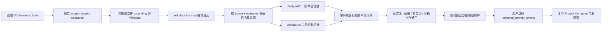

# FlowStudio 上下文相关发散词片 Pipeline 增量实现规格 v1.0

状态：可用于前后端、知识检索与交互评审  
日期：2026-08-03  
上位规格：`FLOWSTUDIO_PROTOTYPE_FRONTEND_BACKEND_DEV_SPEC_V1_ZH.md`

## 0. 决策摘要

More Creative 不再向用户展示脱离当前 3D 对象的通用“风格词”，也不按系统推测的偏好分数替用户排序。它应先读取当前 3D Semantic State，将对象或部件实体 grounding 到 Wikidata；再从 Wikidata 一跳进入与当前作用域和操作相关的临域实体；最后从临域实体连接 Getty AAT 与 AskNature，得到有来源的形态、结构、连接和表面机制，解码成与当前目标绑定的可选短语。

用户看到的应是：

```text
你想如何改变这个把手？

形状   [更弯曲] [更粗壮] [向外延伸] [贴近壶身]
连接   [一体化连接] [清晰的插接结构] [柔和过渡] [可折叠连接]
表面   [温润的木质感] [哑光金属] [细密防滑纹理]
```

系统内部保存的则是完整短语及证据，例如“更弯曲的把手”，并记录：当前把手实体、Wikidata QID、一跳关系、Getty AAT/AskNature 节点、适用操作、作用范围和锁定约束。

本规格只替换/扩展“方向建议 → 人选词片”阶段，不重写以下既有主链：

```text
ActionAtom / Intent Draft
→ PlannerInterpretation 与用户确认门
→ 上下文相关发散词片
→ 用户选择
→ Prompt Compose
→ 既有 Generation Orchestrator
→ Hunyuan3D / 后处理 / OSS
→ Solution Space / Case Library
```

## 1. 与主规格的关系

### 1.1 本规格覆盖的旧口径

当本规格与上位规格的 More Creative 描述冲突时，本规格覆盖以下三点：

1. `Aesthetic / Functional / Structural` 保留为内部兼容维度，不再固定作为用户看到的一级栏目；用户栏目由当前作用域动态生成，例如“形状 / 连接 / 表面”。
2. `scores`、`axis_scores`、`minimum_semantic_distance` 不再用于词片偏好排序或决定哪些词片对用户可见。
3. Getty AAT、AskNature 不是与 Wikidata 平行的三个无条件入口，而是从 Wikidata 临域实体出发的二阶证据源。

### 1.2 继续保留的能力

- design-state IR：继续用于判断用户正在关注整体、轮廓、部件还是材质区域；不用于给词片做偏好排名。
- Planner 确认门：只有已确认的 target/scope/operation 才进入发散。
- `/api/v1/directions/suggest`：继续作为唯一正式建议接口。
- `AnalogyDirection`、`PromptToken`、`selected_prompt_tokens`：增量扩展，不另建一套互不兼容的数据流。
- Prompt Compose、Generation Job、Candidate、SolutionNode、OSS 与案例沉淀：全部复用。
- 下游几何拟合、碰撞、边界兼容和生成质量校验：继续保留；这些是可执行性/安全校验，不是创意偏好打分。

### 1.3 非目标

- 不把本功能做成通用图像生成器的 camera/style/lighting 标签面板。
- 不让 LLM 凭空生成没有知识节点或当前几何证据的词。
- 不因本功能重写 `remote_worker/variation_graph_directions.py` 的完整结构迁移生成链。
- 不在用户选择词片前自动创建 2D/3D Generation Job。
- 不把 Getty AAT 的 preferred term 或 AskNature 页面标题原样堆给用户。

## 2. 产品与交互契约

### 2.1 核心问题必须绑定当前目标

问题模板由作用域决定：

| scope | 问题模板 | 示例 |
| --- | --- | --- |
| `whole` | 你想如何改变这个{对象}的整体？ | 你想如何改变这个水壶的整体？ |
| `silhouette` | 你想如何改变这个{对象}的轮廓？ | 你想如何改变这盏灯的轮廓？ |
| `selected_part` | 你想如何改变这个{部件}？ | 你想如何改变这个把手？ |
| `material_region` | 你想如何改变这片{区域/部件}表面？ | 你想如何改变这片壶身表面？ |

如果当前部件只有 `part_08` 而没有可信语义名，不能展示“你想如何改变这个部件？”并继续发散。Planner 应先通过现有 PartField/SAMPart3D/VLM 命名能力补齐名称；仍歧义时进入 clarification。

### 2.2 一级栏目按目标动态组织

| scope | 默认可见栏目 | 内部兼容维度 |
| --- | --- | --- |
| `whole` | 整体形态、构成、表面 | Structural、Aesthetic |
| `silhouette` | 比例、包络、姿态 | Structural |
| `selected_part` | 形状、连接、表面 | Structural、Functional、Aesthetic |
| `material_region` | 材质、纹理、表面状态 | Aesthetic、Functional |

栏目只在存在通过硬门的词片时出现。不要显示空栏目，也不要为了凑齐三个栏目使用静态词库。

### 2.3 词片显示与内部语义分离

每个词片必须同时包含：

- `display_label_zh`：界面短标签，如“更弯曲”；
- `full_phrase_zh`：可独立进入 prompt 的短语，如“更弯曲的把手”；
- `target_ref`：明确指向 `asset_id / part_id / surface_mask_id`；
- `operation`：如 `deform`；
- `attribute_delta`：如 `curvature: increase`；
- `provenance_path`：完整知识路径。

单独复制、持久化或发送给生成链时，使用 `full_phrase_zh`，不能只发送“更弯曲”。

### 2.4 用户选择行为

- 单击词片选择，再次单击取消；允许跨栏目多选。
- 默认不预选任何词片。
- 不显示百分比、推荐星级、IR 分数、novelty 分数或“最佳”标识。
- 可以稳定轮转展示合格候选，但轮转规则不能声称代表用户偏好。
- 点击证据入口时再展开“来源与为什么适用”，主界面保持自然语言。
- 用户选择后继续复用底部 prompt 与 Generate；未选择时不改变模型。

## 3. 端到端流程



严格执行顺序：

1. 读取当前 3D Semantic State。
2. 确定 `scope`：`whole / silhouette / selected_part / material_region`。
3. 确定 `target`：整个对象、具体 `part_id` 或具体 `surface_mask_id`。
4. 确定允许的 `operation`：`replace / deform / extend / open / perforate / finish`，可多选但必须有证据。
5. 使用当前对象或部件实体进入 Wikidata。
6. first-hop 只保留与当前 scope 和 operation 相关的临域实体。
7. 从临域实体链接 Getty AAT / AskNature。
8. 解码为“形容/机制片段 + 当前目标”的短语。
9. 执行真实性、作用范围、锁定项和可执行性硬检查。
10. 将全部合格词片显示给用户选择，不做偏好打分。

## 4. 3D Semantic State 输入

在现有 `context_snapshot_id` 与 `PlannerInterpretation` 基础上组装，不新建重复的场景状态数据库：

```json
{
  "context_snapshot_id": "ctx_001",
  "asset": {
    "asset_id": "asset_kettle_01",
    "label_zh": "水壶",
    "label_en": "kettle",
    "wikidata_qid": "Q..."
  },
  "scope": "selected_part",
  "target": {
    "type": "part",
    "part_id": "handle_01",
    "label_zh": "把手",
    "label_en": "handle",
    "semantic_role": "grasping and carrying",
    "parent_asset_id": "asset_kettle_01",
    "mask_artifact_id": "mask_handle_01",
    "wikidata_qid": "Q..."
  },
  "operations": ["deform", "extend", "finish"],
  "geometry_facts": {
    "attachment_count": 2,
    "open_loop": true,
    "curvature": "arched",
    "clearance_mm": 34
  },
  "material_facts": ["metal"],
  "locked_constraints": [
    "preserve kettle identity",
    "preserve lid clearance",
    "do not modify spout"
  ],
  "evidence_refs": ["interp_001", "act_brush_09"]
}
```

最小必需字段为 `asset_id`、可信对象名、scope、target、至少一个 operation、锁定项和证据引用。缺失任何一个时返回 clarification，而不是用通用词补位。

## 5. Scope、Target 与 Operation 推断

### 5.1 作用域优先级

1. 用户明确选择的 surface mask。
2. 用户明确选择且已命名的 part。
3. 已确认 PlannerInterpretation 的 target scope。
4. 行为证据：局部 Brush/Hover 进入 part；环绕观察与整体轮廓 Annotation 进入 whole/silhouette。
5. 仍冲突时 clarification。

不能仅由输入文本中的形容词推断 scope，也不能因 IR 推荐 Structural 就自动切到 silhouette。

### 5.2 操作与栏目映射

| operation | 允许作用域 | 主要可见栏目 | 例子 |
| --- | --- | --- | --- |
| `replace` | part、material region | 形状、连接、材质 | 替换为嵌入式把手 |
| `deform` | whole、silhouette、part | 整体形态、比例、形状 | 更弯曲的把手 |
| `extend` | silhouette、part | 包络、形状、连接 | 向外延伸的把手 |
| `open` | whole、part | 构成、连接 | 开放式环状把手 |
| `perforate` | part、material region | 构成、纹理 | 带细密穿孔的罩体 |
| `finish` | whole、part、material region | 表面、材质、纹理 | 哑光金属把手 |

一个词片只能声明一个主 operation；组合操作由用户选择多个词片后在 Prompt Compose 中显式合并。

## 6. Wikidata 实体 Grounding

### 6.1 Grounding 顺序

1. 优先使用资产/部件已缓存的 `wikidata_qid`。
2. 使用 `label_en + parent object + semantic role` 做 Wikidata 实体搜索。
3. 以 `instance of / subclass of / part of` 与对象上下文消歧。
4. 保存选中 QID、标签、描述、别名、实体类型和解析时间。

文本模糊搜索使用 Wikibase search API；实体确定后才用 WDQS/SPARQL 遍历关系。官方文档也明确建议不要用 WDQS 的正则过滤替代文本/模糊搜索。

### 6.2 Source entity 选择

- whole/silhouette：对象 QID 为 source。
- selected_part：部件有独立、具体 QID 时用部件；否则以对象 QID 加 `part semantic role` 组成复合 source。
- material_region：优先使用检测到的材料/涂层实体，同时保留 parent part。

禁止把“更可爱”“未来感”“高级”等审美形容词作为 source entity。

### 6.3 消歧硬门

- 必须是实体而非消歧页、媒体作品、软件或人物。
- 实体类型必须与 artifact、component、material、natural physical structure 等允许类型相容。
- 部件必须与 parent object 或 semantic role 一致。
- 无法唯一确定时不得进入 first-hop。

## 7. Wikidata First-hop 临域遍历

First-hop 不是“取所有邻居”，而是按 scope 和 operation 使用关系白名单得到临域 donor。建议新增 `contextual_graph_policy.py`，将策略配置化。

### 7.1 关系族

| 关系族 | 用途 | 典型 scope/operation |
| --- | --- | --- |
| 类型/实例 | 找同类或相邻类具体实体 | whole、replace |
| part-of / has-part | 找对应构件与装配关系 | selected_part、replace |
| material / made-from | 找材料、涂层、表面家族 | material_region、finish |
| shape / physical characteristic | 找可迁移形态实体 | silhouette、deform、extend |
| use / function | 找承担相近功能的临域构件 | part、open、extend |
| mechanism/biological role bridge | 为 AskNature 查询构造功能机制 | part、surface |

具体 property ID 不能在代码里散落硬编码；以带版本的白名单配置保存，并在测试 fixture 中锁定。

### 7.2 上下文过滤

候选临域实体必须同时满足：

- 与 source 的 first-hop 路径真实存在；
- relation family 在当前 scope 白名单内；
- 能映射到至少一个已确认 operation；
- 不要求改变锁定的对象身份或非目标部件；
- 是具体可解释实体，不是 `object / thing / design / structure` 等泛类。

每个 source 最多保留 8 个合格 first-hop 实体。这里的上限只是延迟和界面容量控制，不是按偏好打分截断；使用稳定的 relation round-robin，避免一个关系族占满结果。

## 8. Getty AAT 与 AskNature 二阶链接

### 8.1 路由原则

- Getty AAT：回答“这种形态、构件、工艺、材质或表面状态叫什么”。
- AskNature：回答“自然界通过什么结构或机制实现类似功能”。
- 两者的 query 均由 `first_hop entity + transferable relation + current operation` 构造，不能直接拿用户原始形容词搜索。

### 8.2 Getty AAT

复用现有 `getty_aat_search()`，保留 AAT ID、preferred term、broader term 与来源 URI。输出可作为：

- form/morphology 术语；
- component/fitting 术语；
- material/finish/coating 术语；
- workmanship/surface treatment 术语。

AAT 术语只有在能转译为当前目标上的可执行 attribute delta 时才进入词片。例如 `matte finish` 可以变成“哑光金属把手”；`architecture` 这类宽泛上位词不能展示。

### 8.3 AskNature

复用现有 AskNature strategy/innovation 页面检索和 URL 作为节点 ID，并优先按其 function taxonomy 构造 query。输出必须抽取：

- living system；
- strategy title；
- function；
- physical mechanism；
- 可迁移到当前目标的结构关系。

页面存在但只有叙事性隐喻、无法产生局部几何/连接/表面机制时，硬门拒绝。

### 8.4 部分源失败

- Wikidata grounding 或 first-hop 失败：整次建议进入 `needs_clarification`，不能绕过。
- Getty 失败：可展示具有完整 AskNature 路径的合格词片。
- AskNature 失败：可展示具有完整 Getty 路径的合格词片。
- 两个二阶源都失败：返回可重试状态，不回落到静态 `AAT_NOUN_BANK`。

## 9. 词片解码

### 9.1 解码对象

LLM 只能对已经检索到并通过关系过滤的节点做受约束解码，不负责发明 donor。输入包含 source、target、scope、operation、geometry/material facts、first-hop、second-hop 与 locks。

### 9.2 允许的句法

```text
[程度/状态 + 可执行形容词] + 的 + [当前目标]
[空间方向 + 操作] + 的 + [当前目标]
[材料/工艺 + 触感/光学状态] + 的 + [当前目标]
[连接/构成机制] + 的 + [当前目标]
```

例如：

- `display_label_zh = 更弯曲`，`full_phrase_zh = 更弯曲的把手`
- `display_label_zh = 清晰的插接结构`，`full_phrase_zh = 采用清晰插接结构的把手连接`
- `display_label_zh = 细密防滑纹理`，`full_phrase_zh = 带细密防滑纹理的把手表面`

### 9.3 禁止输出

- 不含当前目标的独立风格词：`未来感、动漫、超现实、3D render`。
- 摄影/镜头/光照词：`low angle、golden hour、dramatic lighting`。
- 只有 donor 名称：`甲壳、拱券、鲨鱼皮`。
- 无法直接修改 3D 或材质参数的情绪词：`优雅、震撼、治愈`。
- 偷换对象身份的短语：将水壶把手直接变成完整藤蔓、动物或建筑。

## 10. 硬门：不做偏好评分

每个词片通过以下布尔检查：

```json
{
  "entity_resolved": true,
  "first_hop_verified": true,
  "second_hop_verified": true,
  "target_exists": true,
  "scope_match": true,
  "operation_compatible": true,
  "locks_preserved": true,
  "physically_expressible": true,
  "phrase_grounded": true,
  "passed": true
}
```

规则：

- 任一必需门为 false 即不展示。
- 不把这些布尔值加权成总分。
- 不计算或展示 intent alignment、novelty、用户偏好分。
- 同义去重按 `target + operation + canonical attribute delta` 完成，不靠 embedding 分数排名。
- 每栏默认最多 8 个词片；超过时按 provenance source 和 operation 稳定轮转分页，提供“换一组”，不声称后一组更差。

下游 mesh fit、collision、boundary compatibility 可以继续产生数值，因为它们用于判断生成结果能否安全落到 3D 场景，不参与本阶段创意词片选择。

## 11. 增量数据契约

### 11.1 ContextualFragment

```json
{
  "fragment_id": "frag_handle_curve_01",
  "display_label_zh": "更弯曲",
  "full_phrase_zh": "更弯曲的把手",
  "label_en": "more curved handle",
  "group": {"key": "shape", "label_zh": "形状"},
  "legacy_dimension": "Structural",
  "scope": "selected_part",
  "target_ref": {
    "asset_id": "asset_kettle_01",
    "type": "part",
    "id": "handle_01",
    "label_zh": "把手"
  },
  "operation": "deform",
  "attribute_delta": {"attribute": "curvature", "change": "increase"},
  "provenance_path": {
    "source": {"graph": "wikidata", "id": "Q...", "label": "handle"},
    "first_hop": {"id": "Q...", "label": "...", "relation": "..."},
    "second_hop": {
      "graph": "getty_aat",
      "id": "300...",
      "label": "...",
      "url": "http://vocab.getty.edu/aat/300..."
    }
  },
  "hard_gates": {"passed": true},
  "constraints": ["preserve lid clearance"],
  "source_direction_id": "dir_001"
}
```

### 11.2 复用 `/api/v1/directions/suggest`

请求新增字段优先放进现有 `metadata`，避免立即破坏客户端：

```json
{
  "session_id": "sess_001",
  "asset_id": "asset_kettle_01",
  "intent_draft_id": "draft_012",
  "interpretation_id": "interp_001",
  "context_snapshot_id": "ctx_001",
  "scope": {"type": "selected_part", "part_id": "handle_01"},
  "preserved_constraints": ["preserve lid clearance"],
  "metadata": {
    "suggestion_mode": "contextual_fragments_v1",
    "semantic_state": {},
    "operations": ["deform", "extend", "finish"],
    "ranking_mode": "user_selection"
  }
}
```

响应继续返回 `directions[]`，同时在 metadata 中增加：

```json
{
  "directions": [],
  "metadata": {
    "suggestion_mode": "contextual_fragments_v1",
    "ranking_mode": "user_selection",
    "question": "你想如何改变这个把手？",
    "groups": [
      {"key": "shape", "label_zh": "形状", "fragment_ids": []}
    ],
    "contextual_fragments": [],
    "retrieval_audit": {},
    "partial_sources": []
  }
}
```

`directions[]` 继续承载可展开的类比/证据路径；`contextual_fragments[]` 是真正渲染为 chips 的单位。

### 11.3 兼容字段

- `AnalogyDirection.score` 改为可空，contextual 模式返回 `null`；旧模式暂时可继续返回数值。
- `PromptToken.weight` 改为可空；contextual 模式不读取、不排序。
- PromptToken 增加 `full_phrase_zh`、`group_key`、`target_ref`、`operation`、`attribute_delta`、`provenance_path`。
- `dimension` 继续填写 legacy dimension，供已有日志和 Prompt Compose 兼容，不作为 UI 一级标题。

## 12. 后端实现与模块复用

### 12.1 `backend/app/models.py`

- 新增 `ContextualFragment`、`TargetRef`、`ProvenancePath`、`HardGates` Pydantic 模型。
- 将 `AnalogyDirection.score` 调整为 `float | None = None`。
- 不新建第二套 direction response。

### 12.2 `backend/app/api/directions.py`

- 保留 `/api/v1/directions/suggest`。
- 根据 `metadata.suggestion_mode == contextual_fragments_v1` 路由到新服务。
- `/directions/cross-domain` 继续只是 deprecated proxy，不增加逻辑。

### 12.3 `backend/app/main.py`

现有 `create_direction_suggestions()` 继续负责读取 session、asset、Intent Draft、PlannerInterpretation 与约束；将检索/解码委托给独立服务，避免继续扩大 `main.py`。

新增建议：

```text
backend/app/services/contextual_divergence.py
backend/app/services/contextual_graph_policy.py
backend/app/services/fragment_decoder.py
```

contextual 模式不再调用现有通用 `_qwen_cross_domain_response()`、`_analogy_prompt_tokens()` 的静态 fallback。旧模式可暂留，迁移完成后删除。

### 12.4 `remote_worker/variation_graph_directions.py`

复用：

- `FACETS` 中 stage 对 mutable/locked facets 的定义；
- `_wikidata_candidates()` 的实体读取思路；
- `_getty_candidates()` / `getty_aat_search()`；
- `_asknature_candidates()` 的真实页面节点与 URL；
- `_kg_proxy()`、超时、审计与错误暴露逻辑。

不要直接复用：

- `retrieve_three_graphs()` 的平行三图入口语义；
- `score_candidates()`、`select_top_diverse()`、`select_material_family_diverse()`；
- 为生成图像而设计的完整 `structure_mapping()` 输出。

建议抽出共享 adapter，而不是复制 HTTP 代码：

```text
remote_worker/knowledge_adapters/wikidata.py
remote_worker/knowledge_adapters/getty_aat.py
remote_worker/knowledge_adapters/asknature.py
```

旧结构迁移 pipeline 和新 contextual fragment pipeline 同时依赖这些 adapter，但各自保留编排顺序。

## 13. 前端实现与模块复用

主要修改 `frontend/src/main.tsx`，不重做右栏整体布局。

### 13.1 保留

- `runDirectionsSuggest()` 的请求时机与 race protection；
- `selectedPromptTokens`、`togglePromptToken()`；
- `buildAnalogyPromptPackage()`；
- `/api/v1/prompt/compose` 与 Generate 按钮；
- Solution Space 生成与展示。

### 13.2 替换

- `dimensionGroupsForMoreCreative()`：改为读取服务端 `groups`，不计算 score、不排序。
- `AAT_NOUN_BANK` 与 `aatNounPromptTokens()`：contextual 模式完全禁用；不得用静态英文名词补齐。
- 面板标题：从 Aesthetic/Functional/Structural 改为动态中文栏目。
- `scoreLabel`：移除。
- 顶部 scope 文案：改为服务端 `metadata.question`。

### 13.3 选择与提交

chip 显示 `display_label_zh`，tooltip 可显示完整短语与来源；`buildAnalogyPromptPackage()` 提交 `full_phrase_zh` 和完整 target/provenance，而不是只提交 label/weight。

选中多个词片时，Prompt Compose 应输出带目标的明确组合，例如：

```text
把手更弯曲并略向外延伸，采用柔和过渡的连接，表面使用细密防滑纹理；保持壶盖间隙与壶嘴不变。
```

不是：

```text
more curved, outward, soft, texture
```

## 14. 与生成链的衔接

用户点击 Generate 后继续走现有链路：

1. `/api/v1/prompt/compose` 接收所选词片。
2. 组合 base prompt、target、operation、attribute delta、locks 与 provenance。
3. 创建既有 Generation Job，而不是 contextual pipeline 自建 job。
4. 生成必须产生非空 transfer rationale 与 concrete target。
5. Hunyuan3D、后处理、OSS 上传、Candidate/SolutionNode 与案例前端同步保持原实现。

如果用户选择的词片互相冲突，例如“贴近壶身”与“向外大幅延伸”同时选中，Prompt Compose 返回 `needs_resolution` 并指出冲突，不静默挑一个，也不按权重覆盖。

## 15. 状态、缓存与可追溯性

### 15.1 缓存键

```text
grounding: label_en + parent_qid + semantic_role
first-hop: source_qid + relation_policy_version
second-hop: graph + first_hop_id + operation + adapter_version
fragments: context_snapshot_id + target_id + operations + locks_hash
```

Wikidata/Getty 节点缓存 7 天；AskNature 页面摘要缓存 24 小时；context fragment 缓存只在 target、scope、operations、locks 均未变化时复用。

### 15.2 失效条件

- active asset version 改变；
- part 或 surface mask 改变；
- Planner interpretation 被纠正/拒绝；
- lock constraint 改变；
- 用户进入下一轮明确编辑。

### 15.3 审计

每次响应保存 `retrieval_audit`：grounding 候选、最终 QID、遍历 relation、命中/拒绝节点、拒绝硬门、网络错误、adapter/version 和耗时。前端默认不展示内部日志，但研究回放必须可取。

## 16. 错误状态

| 状态 | 前端行为 |
| --- | --- |
| `needs_clarification` | 显示具体问题，如“你指的是壶盖提手还是壶身侧把手？” |
| `retrieving` | 保留当前模型与旧选择，显示检索中 |
| `partial_sources` | 正常展示合格项，并在证据层标明缺失源 |
| `no_grounded_fragments` | 不显示通用词；建议用户改变目标或操作 |
| `stale_context` | 丢弃响应并以新 context_snapshot 重试 |
| `needs_resolution` | 在生成前要求解决所选词片冲突 |

禁止静默回退到 mock、静态词库或旧的 generic Qwen suggestions。

## 17. 性能预算

- 已缓存 grounding：100 ms 内。
- Wikidata first-hop：P95 1.5 s 内。
- Getty 与 AskNature 二阶并行：P95 3.5 s 内。
- 解码与硬门：P95 2 s 内。
- 首组 chips：冷启动目标 6 s 内；超过 2 s 显示可取消的检索状态。

只允许 Getty 与 AskNature 在 first-hop 完成后彼此并行；不能退回三个知识源同时从原始 query 出发。

## 18. 测试方案

### 18.1 单元测试

- scope/target/operation 推断优先级。
- Wikidata 消歧拒绝媒体作品与泛类。
- relation whitelist 对各 scope 的允许/拒绝。
- fragment decoder 保证 target、operation、attribute delta 完整。
- hard gate 任一失败不展示。
- 同义去重不依赖 score。
- Prompt Compose 冲突检测。

### 18.2 固定场景

| 场景 | 预期问题 | 预期栏目 | 必须拒绝 |
| --- | --- | --- | --- |
| 水壶把手 | 你想如何改变这个把手？ | 形状、连接、表面 | golden hour、anime、architecture |
| 音箱网罩 | 你想如何改变这个网罩？ | 形状、构成、表面 | 与声学/穿孔无关的自然叙事 |
| 雪人整体 | 你想如何改变这个雪人的整体？ | 整体形态、构成、表面 | 把雪人替换成 donor 对象 |
| 灯罩轮廓 | 你想如何改变这盏灯的轮廓？ | 比例、包络、姿态 | 材质词占据轮廓栏目 |
| 壶身局部表面 | 你想如何改变这片壶身表面？ | 材质、纹理、表面状态 | 改变把手或壶嘴 |

### 18.3 集成测试

1. 从选中 part 到 `/directions/suggest` 返回 question/groups/fragments。
2. 词片全都带 target 和可打开的 provenance。
3. UI 不显示任何 score 且初始无预选。
4. 选择词片后 `/prompt/compose` 收到 `full_phrase_zh`。
5. Generate 继续创建既有 job，Hunyuan3D → OSS → Solution Space 链完整。
6. context 更新时旧响应不会覆盖新目标。

## 19. 验收标准

- 任取一个已语义命名的对象、部件或表面区域，界面问题都明确指向当前目标。
- 主界面词片是具体可操作的中文形容/结构短语，而非本体名、风格类目或摄影词。
- 每个词片能追溯到 Wikidata source → first-hop 临域 → Getty AAT 或 AskNature 二阶节点。
- 没有证据的词片不展示；知识源失败时不以静态词库补齐。
- UI 不显示、计算或使用创意偏好排名；所有合格项由用户选择。
- design-state IR 只决定上下文与栏目，不替用户选方向。
- 选择词片前不生成；选择后完整复用现有 Prompt Compose 和 CreativeFlow 生成主链。
- 已确认约束、非目标部件和对象身份被显式带入 hard gate 与生成 prompt。
- 现有 `/api/v1/directions/suggest`、选词状态和 Generation API 继续工作，无大规模架构迁移。

## 20. 分阶段落地与文件清单

### Phase A：契约与 UI（不接假数据）

- 扩展 Pydantic/TypeScript 类型。
- 前端支持 question、动态 groups、ContextualFragment 和无分数选择。
- 移除 contextual 模式的 `AAT_NOUN_BANK` fallback。

### Phase B：检索编排

- 抽取知识源 adapter。
- 完成 Wikidata grounding、first-hop policy、Getty/AskNature second-hop。
- 加入缓存、审计、超时和 partial source 状态。

### Phase C：解码与硬门

- 受约束生成 `display_label_zh/full_phrase_zh`。
- 完成 scope/operation/locks/physical expressibility gates。
- 接通真实 `/directions/suggest`。

### Phase D：生成闭环与研究记录

- 扩展 selected prompt package。
- 验证 Hunyuan3D、OSS、Solution Space、Case Library 全链。
- 保存用户选择/取消/组合行为，但不将其即时变成候选排序。

建议变更文件：

| 文件 | 变更 |
| --- | --- |
| `backend/app/models.py` | 增量数据模型与 nullable score |
| `backend/app/api/directions.py` | contextual mode 路由 |
| `backend/app/main.py` | 复用上下文组装，委托新 service |
| `backend/app/services/contextual_divergence.py` | 新编排服务 |
| `backend/app/services/contextual_graph_policy.py` | scope/operation relation policy |
| `backend/app/services/fragment_decoder.py` | 词片解码与硬门 |
| `remote_worker/knowledge_adapters/*` | 三知识源共享 adapter |
| `frontend/src/main.tsx` | 动态问题/栏目/词片与无分数 UI |
| `frontend/src/styles.css` | 仅增量调整 chip group 与 provenance drawer |
| `tests/*` | 单元、契约、集成和固定场景 |

## 21. 外部依据

- Wikidata 的官方数据访问说明区分实体搜索与 WDQS/SPARQL：文本或模糊搜索不应使用 SPARQL 正则替代；实体确定后可通过 SPARQL 查询关系：<https://www.wikidata.org/wiki/Help:Data_access>
- Getty Vocabularies 将 AAT 作为 Linked Open Data 提供，可通过其 URI/SPARQL 保留 preferred term、层级和稳定概念 ID：<https://www.getty.edu/research/tools/vocabularies/>
- AskNature 的 Biomimicry Taxonomy 按 function 组织 biological strategies，适合作为“功能 → 生物机制”的二阶证据，而不是一般审美词库：<https://asknature.org/resource/biomimicry-taxonomy/>

