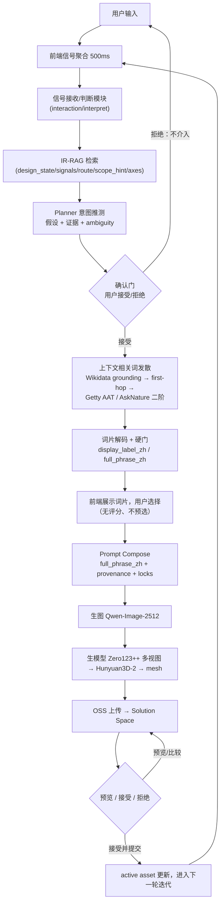

# FlowStudio 模块梳理与端到端数据流 V1

状态：按当前实现 + 两份规格（主规格 v1.2 / 增量规格 v1.0）整理  
日期：2026-08-03

## 0. 一句话

用户的多类输入 → 前端聚合为信号 → 信号接收/判断模块（含 IR-RAG 状态检索）
→ Planner 意图推测 + 用户确认门 → 上下文相关词发散（Wikidata → Getty/AskNature）
→ 前端人选词片 → Prompt Compose → 生图 → 生模型 → Solution Space 迭代。

## 1. 端到端数据流

## 2. 模块清单（输入 → 接收 → 判断 → 输出 → 下一步）

| 用户输入 | 前端采集 | 后端接收/判断模块 | IR-RAG 角色 | 输出 | 下一步 |
| --- | --- | --- | --- | --- | --- |
| 相机观察（orbit/zoom/dwell） | `handleViewportInteraction` 聚合计数 | `interaction/interpret` + live-signals | scope=whole/silhouette | 观察类证据 | 意图推测 |
| Hover | raycast + 停留计时 + OBJ-group 兜底标签 | `actions` / `hover` 事件 | scope=part | 部件关注证据 | 意图推测 |
| Brush | 3D 表面 mask | `brush-masks` | scope=part/material | 局部作用范围证据 | 意图推测 |
| Annotation | 2D 笔画层 + OCR/图形识别 | `annotations` | scope=whole/silhouette | 轮廓/标记证据 | 意图推测 |
| Drag / Smooth / Add | 3D 操作 + primitive | `drag-operations` / `smooth-operations` / `primitive-additions` | scope=part/whole | 几何修改证据 | 意图推测 |
| 文本 | 底部 prompt | episode / typed intent | axes 线索 | 语言意图 | 意图推测 |
| 参考图/参考模型 | 上传 + role 判断 | `reference-images` / `reference-models` | 图片角色证据 | 多模态引用 | 意图推测 |
| 用户确认门 | 澄清泡泡 接受/拒绝 | `interpretations/{id}/decision` | — | 确认的 scope/约束 | 进入发散 |
| （Planner 结果） | — | contextual divergence service（Phase 2 落地） | 只定上下文/栏目，不排序 | 词片 + 证据路径 | 前端选择 |
| 用户选择词片 | chip 多选 | `prompt/compose` | — | final prompt + provenance | 生图 |
| 生图 | — | generation orchestrator → remote worker | — | image candidate | 生模型 |
| 生模型 | — | `/jobs/hy3d-from-staged`（Zero123++ → Hy3D-2） | — | mesh.glb/obj → OSS | Solution Space |

## 3. 与你梳理的对照（三处校正）

你描述的链路：输入 → 信号接收/判断 + IR-RAG → 得出发散词 → Wikidata/ Getty/AskNature
上下文发散 → 前端选择 → 生图 → 生模型。整体正确，三点需要精确化：

1. **“得出发散词”之前有确认门**：信号判断后，Planner 先输出意图假设（含 evidence、
   ambiguity），用户必须接受/拒绝后才进入发散；拒绝则不介入（主规格 1.4/8.2）。
2. **IR-RAG 不产出发散词、不排序词片**：IR 只判断“用户处于什么设计状态、scope 是什么、
   下一步沿哪些轴发散”（design_state/signals/route/scope_hint/recommended_axes）；
   词片由上下文发散流程产生，IR 不参与偏好评分（增量规格 1.1/1.2/10）。
3. **Wikidata/ Getty/ AskNature 不是三个平行入口**：顺序是
   “当前对象/部件 grounding 到 Wikidata → first-hop 临域遍历（关系白名单过滤）
   → 从临域实体连 Getty AAT 与 AskNature 二阶”，二阶源失败可降级但不可绕过 Wikidata
   （增量规格 6/7/8）。

另外补两点：

- 输入不只文本/图片/模型，还有六种直接操作工具与相机观察，都属于“信号”；
- 生成链路是图片先到、模型后到（Hy3D 由 Make 3D 或 auto 触发），不是一步到位。

## 4. 与当前实现/修补计划的关系

- **已实现**：前端信号聚合、六工具采集、`interaction/interpret` 规则+IR 判断、
  Planner 确认门、`directions/suggest`（旧 Qwen 模式）、prompt/compose、
  Qwen-Image → Zero123++ → Hunyuan3D-2 真实生成链、Solution Space。
- **未实现（Phase 2）**：上图中“上下文相关词发散”整段——Wikidata grounding、
  first-hop 白名单、Getty/AskNature 二阶、词片解码与硬门、无评分呈现；
  当前仍走旧的 Qwen 通用建议 + 静态词库兜底，需按
  `FLOWSTUDIO_CONTEXTUAL_DIVERGENCE_FRAGMENT_PIPELINE_V1_ZH.md` 落地
  （对应 `FLOWSTUDIO_REMEDIATION_PLAN_3PHASE_V1_ZH.md` Phase 2）。
