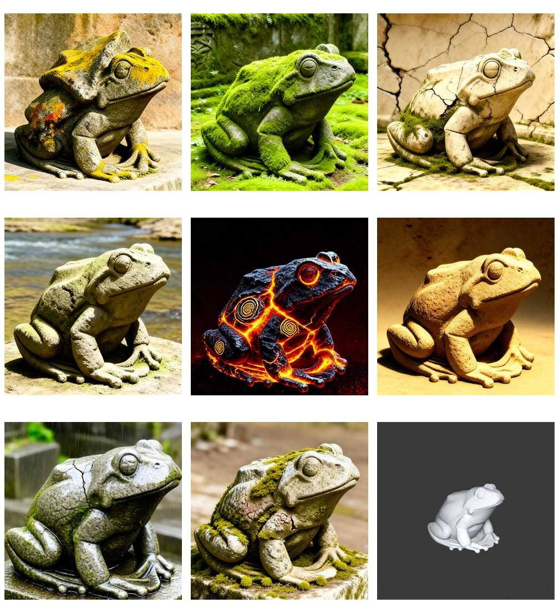
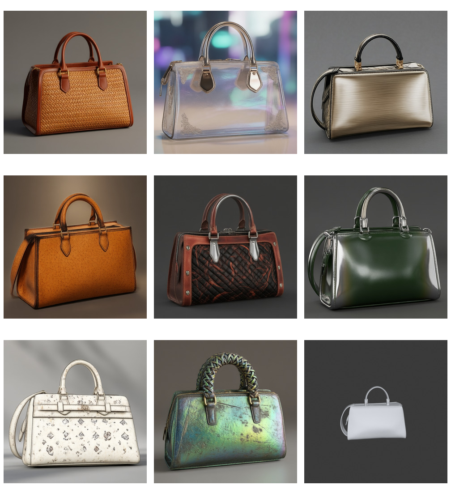
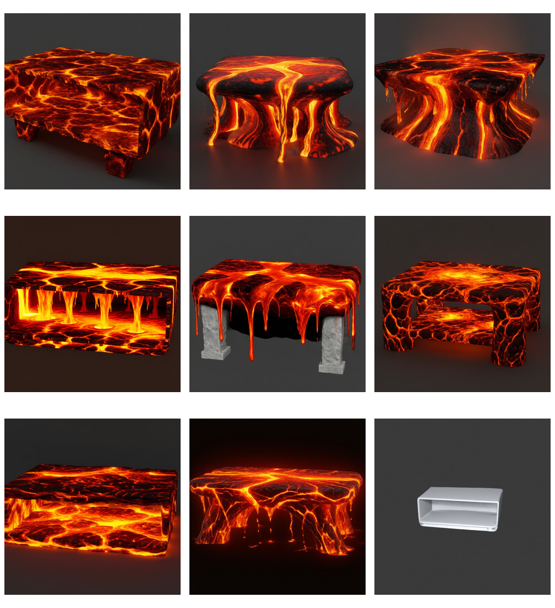

# FlowStudio 三场景白模发散验收（2026-08-06）

## 1. 结论

三种场景均已通过真实 FlowStudio 链路生成 8 个候选，不是手写示意图或外部样例：

`白模资产 → clay 截图 → 常驻 Observation → 行为窗口 → Send cutoff → 单句 Gate → 用户关键词 → Prompt Builder → Qwen Image Edit → 8 个 Solution`

本轮同时修复了两个链路问题：

1. 后端截图现在支持 `clay=true`，保证生成输入真的是无材质白模，而不是只在浏览器里显示成白色、后台仍读取原 GLB 材质。
2. 每个候选只绑定一个用户选择的方向关键词。旧逻辑会把全部关键词写入每个 prompt，导致第一个强语义（如 moss、rattan）吞掉整个批次。

## 2. 公共产品契约

- Observation 始终运行；行为提交后实时规则编码和检索，不由 Send 启动。
- Send 只锁定 `cutoff_seq` 之前的行为窗口；之后的新操作属于下一个 intent。
- 每个 intent 只有一个范围 Gate；Gate 不询问具体迁移方向。
- Gate 通过后，人的关键词决定具体发散方向。
- 一个已接受 intent 生成一个追加批次，本轮每批 8 个 Solution。
- 所有 prompt 都必须同时携带可变方向和 identity/功能不变量。

## 3. Scenario 1：角色叙事迁移（frog → stone-statue frog）

### 输入与信号

- 白模：`src_20260403112017_d949`，object type 为 `frog`。
- 行为：一次 3D drag + 一次 smooth；一个工具从开始到结束记为一个 Behavior，而不是一笔一个 Behavior。
- 文本意图：将小青蛙叙事迁移为石像青蛙，保留物种、头身比例、四肢数量、蹲伏姿态和轮廓。
- Observation：`formation`，命中 `formation.primary`。
- 单句 Gate：`你想改变这个 frog 的表面或材质吗？`
- Session / Run：`sess_32e07a511d` / `fsrun_3a190a7cd5`。

### Prompt 链

场景 profile：`narrative_character`。

每个候选都写入以下硬约束：

- preserve frog identity；
- preserve complete recognizable silhouette, anatomy, pose and part count；
- preserve category-defining facial and limb cues；
- do not replace the frog with another object or species；
- keep source camera, composition and background；
- material Gate 下继续锁定 exact geometry、silhouette、proportions 和 every part shape。

8 个候选分别只使用一个方向：weathered basalt、moss shrine relic、cracked marble、river-stone idol、volcanic seams、sandstone votive、rain-polished granite、archaeological patina。

### 结果

8/8 保持青蛙物种身份、蹲姿、眼睛和四肢关系；八种石材/年代/风化叙事可区分。volcanic 方向变化最强，但仍可辨认为同一类青蛙角色。

## 4. Scenario 2：产品材质多样性（same handbag, material-only）

### 输入与信号

- 白模：`src_20260430155836_4808`，object type 为 `leather handbag`。
- 行为：2D brush，记录 mask coverage、覆盖包身区域以及排除提手/拉链/五金区域。
- 文本意图：只改变材质；锁定包身轮廓、比例、提手、开口、缝线、五金和镜头。
- 单句 Gate：`你想改变这个 leather handbag 的表面或材质吗？`
- Session / Run：`sess_150eb2660d` / `fsrun_9ec1bd552f`。

### Prompt 链

scope：`material`。每个 prompt 都包含：

- part-aware semantic material transfer；
- preserve exact geometry, silhouette, proportions and every part shape；
- preserve pose, camera, composition and background；
- preserve category-defining features and part roles；
- distribute materials by semantic region，不把单一 donor material 均匀覆盖所有部件。

8 个候选分别绑定：woven rattan、frosted polymer、brushed aluminum、cork、quilted textile、recycled rubber、ceramic glaze、iridescent bio-resin。

### 结果

8/8 保持 handbag 类别和主要部件关系，八类材质均能清楚区分。与首轮全部被 rattan 主导相比，关键词隔离修复有效。

但本场景只在 2D image-edit 空间生成，因此提手弧度、包体宽高仍有轻微漂移；它通过“产品 identity”验收，但不通过“原网格逐顶点完全一致”验收。若产品要求完全相同形态，下一步必须把生成结果转为 PBR/material proposal 并回贴原始 mesh，原 mesh 不得由生成图重建。

## 5. Scenario 3：产品结构多样性（coffee table → flowing lava structures）

### 输入与信号

- 白模：`src_20260429114410_5011`，object type 为 `coffee table`。
- 行为：3D brush，记录 tabletop edge、support transition、base 的体积笔刷与向下流动手势。
- 文本意图：熔岩结构迁移；仍须为可用茶几，保留水平桌面、尺度、承重关系和桌面—支撑拓扑；禁止只换贴图。
- 单句 Gate：`你想改变这个 coffee table 的整体轮廓吗？`
- Session / Run：`sess_4bb6b490f3` / `fsrun_ad9e25da5b`。

### Prompt 链

场景 profile：`product_structure`。硬约束为：

- preserve furniture category identity and scale；
- preserve a horizontal usable tabletop and plausible load-bearing support；
- preserve tabletop-to-support topology and full-object framing；
- structural morphology must visibly diverge；texture-only recoloring is insufficient。

8 个候选分别绑定：cantilevered shelf、braided molten supports、caldera pedestal、basalt crust/core、dripping edge + stone legs、lava-tube frame、cooled magma terraces、molten bridge supports。

### 结果

8/8 保持茶几可读性和水平主表面；支撑家族、开口方式和流动结构有明确差异，达到了结构发散而非同一模型换熔岩贴图。

## 6. 状态估计说明

当前 MVP 使用 20 秒行为窗口和两窗口稳定机制。显式 brush/drag 会给 formation 主证据，但非 evaluation 状态需要连续证据才正式切换，以避免一次误触导致阶段跳变。因此：frog 的 drag + smooth 达到 `formation`；handbag 和 coffee table 本轮各只有一个完整 brush Behavior，结束时仍为 `observe`、pending formation。若实验要验证状态切换而不仅是 prompt 链，应在同一 Send 前记录第二个 brush tool session，不能伪造为“一笔一个 Behavior”。

## 7. 本轮异常与边界

- 外部 Gemini planner 在一次 frog 复跑中超过 180 秒；最终 frog 验收使用系统内置 deterministic rule-decision fallback，仍完整经过 Gate、关键词和 GPU 生成。生产上应给 Gemini 总调用设置硬截止并自动回退，不能让 revision 永久停在 planning。
- Quality Gate 曾因 narrative profile 没有复述旧固定模板短语而误判；现已改为检查共同 object/goal prefix 与实际 geometry/identity 约束。
- 2D image result 不能证明 3D mesh identity。材质场景的严格形态锁定需要后续 PBR-on-original-mesh 链路。

## 8. 可复跑交付物

- 运行器：`scripts/live_three_scenario_acceptance.py`
- frog 完整真实 trace：`outputs/three_scenario_acceptance_2026_08_06_frog_v4.json`
- handbag / coffee table 完整真实 trace：`outputs/three_scenario_acceptance_2026_08_06_v2.json`
- 每条 trace 包含：asset、clay render、Behavior、Observation、revision、Gate、selected option、batch、GenerationSpec、8 条最终 prompt、seed 与 artifact URL。

