# CreativeFlow 三类 Variation 设计与开发实现说明

## 1. 目标与边界

在 CreativeFlow Original 的主链上新增三个 variation：

- Low Fidelity：扩展并改变 source 的整体形态描述。
- Part：先从 brush mask 解析出部件语义，再扩展并改变该部件的描述。
- Texture：保持 source 的主体结构和元素，扩展并改变材质描述。

三类 variation 均使用同一条三阶段主链：

```text
Stage 1：KG 扩展与排序（生文字）
Stage 2：source image + 排序后的 prompt → Qwen Image（生图）
Stage 3：合格图片 → Hunyuan3D 2.1 + PaintPBR（生 3D）
```

本方案明确不使用 PartField，不用二维拼图、裁切粘贴、几何变形、生成后合成、mask inpainting 或 ControlNet。

## 2. 总体架构

```mermaid
flowchart LR
    A["Source image + variation facet"] --> B["Planner: executable seed attributes"]
    B --> C["Attribute-specific query expansion"]
    C --> D["Wikidata · Getty AAT · AskNatureNet"]
    D --> E["3D feasibility + structural transferability + Gaussian novelty"]
    E --> F["2 near + 2 far"]
    F --> L["Structure Mapping Theory"]
    L --> M["Raw KG target + mapping"]
    M --> N["Fixed PromptCompiler"]
    A --> G["Qwen native image-to-image"]
    N --> G
    G --> H["Image QA and diversity record"]
    H --> I["Hunyuan3D 2.1"]
    I --> J["PaintPBR + GLB/OBJ"]
    J --> K["Front / side / three-quarter renders"]
```



Part 比另外两条链多一个只发生在 Stage 0 的语义解析步骤：

```text
brush mask + source/SAM3D evidence
→ 判断用户选中的部件名称
→ selected_part_noun（例如 nose）
```

mask 的职责到 `selected_part_noun` 为止。它不进入 Stage 2，不传给 Qwen Image，不参与 ControlNet，也不用于生成后的像素合成。

## 3. Stage 0：提取 source 与 Part 选择语义

### 3.1 Low Fidelity

必须得到 source noun 与可供 Planner 观察的全局形态事实，例如：

```json
{
  "source_noun": "snowman",
  "variation_slot": "shape",
  "visible_form_evidence": [
    "compact upright two-lobed figure",
    "bottom-heavy broad lower body",
    "two rounded segments"
  ]
}
```

不需要从图片抽取轮廓线，也不需要把 source 变成 edge image。形态变化来自 KG target 写入提示词中的形态槽位。

### 3.2 Part

输入：

```json
{
  "source_image_path": "/path/source.png",
  "brush_mask_path": "/path/user_brush.png",
  "sam3d_manifest_path": "/path/sam3d_manifest.json"
}
```

输出只需要具体部件名和证据：

```json
{
  "selected_part_noun": "nose",
  "confidence": 0.93,
  "evidence": {
    "sam3d_cluster_id": 7,
    "views": ["front", "front_left"]
  }
}
```

解析器不应因为编码器阈值过严而拒绝常见部件。只要 mask 所指区域可以稳定识别为具体部件，就把具体名交给 KG；低置信度时重试一次 VLM 解析或请求用户确认。

### 3.3 Texture

必须得到 source noun、当前 editable body material 与表面事实：

```json
{
  "source_noun": "snowman",
  "current_material": "packed snow",
  "variation_slot": "material",
  "visible_material_evidence": [
    "white matte diffuse body",
    "fine compacted granules",
    "subtle crystalline sparkle"
  ]
}
```

Texture 不需要 material mask。主体结构保持由 source image 和提示词共同表达。

## 4. Stage 1：论文一致的 Attribute-first KG 扩展与评分

知识图谱迁移是工程阶段，不写成生图 prompt 中的一段解释。

### 4.1 唯一执行顺序

三条链均执行以下顺序，不保留“先生成 target/relation，再反推 source attribute”的旁路：

```text
source image + variation facet
→ multimodal planner 提取 morphologically actionable seed attributes
→ 每个 attribute 生成 graph-specific expansion queries
→ 分别访问 Wikidata / Getty AAT / AskNatureNet
→ raw KG node retrieval + provenance
→ same-attribute gate
→ 3D feasibility + structural transferability + visible decodeability
→ Gaussian medium-distance novelty
→ semantic-distance grouping + 2 near / 2 far
→ Structure Mapping Theory
```

论文对应的三个图谱职责：

- Wikidata：ontology / physical entity attributes；
- Getty AAT：aesthetic form、material、craft、workmanship；
- AskNatureNet：biomimetic structure、function、material strategy。

每一个 query 必须保存 `attribute_id`，检索出的候选也必须携带同一个 `attribute_id`。若 scorer 判断 target 并未体现该 source attribute，候选直接淘汰。

### 4.2 Executable seed attributes

Planner 不能输出 target 或风格灵感，只输出 source-grounded attribute：

```json
{
  "source_anchor": "snowman",
  "attributes": [
    {
      "attribute_id": "attr_01",
      "dimension": "segment_structure",
      "value": "two rounded segments",
      "evidence": "larger lower body plus smaller head",
      "transfer_question": "which cross-domain entities exhibit the same organization?",
      "confidence": 0.9
    }
  ]
}
```

三类允许的 attribute dimension：

| Variation | Planner 可输出的 attribute |
|---|---|
| Low Fidelity | global shape、silhouette、segment structure、proportion、mass distribution、global topology |
| Part | selected-part shape/function、attachment、orientation、articulation、interface |
| Texture | material family、microstructure、roughness、finish、optical response、color behavior、weathering |

### 4.3 三图谱 Query Expansion

同一个 attribute 被分别翻译为三类 query，但 attribute 不变：

```json
{
  "attribute_id": "attr_01",
  "attribute_value": "two rounded segments",
  "graph": "asknature",
  "term": "short physical search term",
  "distance_intent": "far",
  "same_attribute_rationale": "the query searches the same segmentation organization"
}
```

query 是检索探针，不是最终 target。最终 target 必须是图谱返回的 raw node，并保存 graph node id、query term 和 edge/provenance。

### 4.4 论文 Scoring Engine

候选的总分为：

```text
Score(s, c) =
    0.24 × attribute_alignment
  + 0.24 × feasibility_3d
  + 0.24 × structural_transferability
  + 0.10 × visible_decodeability
  + 0.14 × gaussian_novelty
  + 0.04 × source_attribute_confidence

gaussian_novelty = exp(-((d_sem(s,c) - μ)^2) / (2σ^2))
μ = 0.55, σ = 0.22
```

Gaussian novelty 在中等语义距离达到峰值，避免 trivial neighbour 和 logically disconnected target。 broad ontology class、非物理概念、错误 variation facet、无法形成单体 3D、或无法映射回同 attribute 的候选均 hard reject。

### 4.5 Structure Mapping 在评分之后

只有最终 2 near + 2 far 才执行 SMT，生成：

```text
source attribute
↔ donor relational property
→ one visible transfer operation
```

SMT 不能更改 raw KG target，也不能打开 locked facets。Stage 2 仍使用 raw KG target 固定句式；mapping 作为可审计的迁移依据与 3D 复查信息保留。

需要保留的审计字段：

```json
{
  "source_attribute_id": "attr_01",
  "source_attribute": "two rounded segments",
  "candidate_relation": {
    "relation": "transfers same attribute: segment_structure",
    "query_graph": "asknature",
    "query_term": "..."
  },
  "raw_kg_target": "verbatim graph label",
  "graph_provenance": [],
  "paper_scoring": {
    "feasibility_3d": 0.88,
    "structural_transferability": 0.84,
    "gaussian_novelty": 0.91,
    "total_score": 0.86
  },
  "semantic_distance": 0.67,
  "distance_bucket": "far",
  "structure_mapping": {}
}
```

### 4.6 三类 source anchor 与目标槽位

| Variation | KG 起点 | 扩展结果写入的槽位 |
|---|---|---|
| Low Fidelity | source noun；attribute 来自可见全局形态 | shape |
| Part | SAM3D-resolved selected part noun；attribute 来自该部件 | selected part form/type |
| Texture | editable body material；attribute 来自当前材质/表面 | material |

Part 的 mask 不在 KG 上跳跃；真正参与 KG 的是由 mask 解析出来的 `selected_part_noun`。

### 4.7 2 near + 2 far

- near：通过原版 semantic-distance 计算，与 seed/当前属性语义距离较近的合格 target。
- far：通过同一个距离空间得到、距离更远但仍通过原版可解释性和黑名单清洗的 target。
- 先清洗和评分，再在合格候选中分桶；不是手工写死四个词。
- 每个结果必须保留 source attribute、三图谱 query/evidence、raw target、距离、paper score 和 structure mapping。

### 4.8 Raw target 原样输出

不做 phrase normalization，不把 target 改写成更“自然”的短语。PromptCompiler 直接使用排序后的 `raw_kg_target`，以保证结果能追溯回图谱节点。

## 5. Stage 2：固定句式 + Qwen 原生图生图

Stage 2 的输入统一为：

```text
source image + compiled prompt + seed
```

不用 mask、不用 ControlNet、不做 crop/paste/composite，也不对 source 提取 edge 或轮廓图。Qwen 生成的整张图片就是候选结果。

### 5.1 Low Fidelity PromptCompiler

固定句式：

```text
发挥你的创造力，畅想一个[raw KG target]形状的[source noun]，纯白色无影棚背景（RGB 255,255,255），无地面、无阴影、无场景、无其他物体，单体居中，完整展示
```

示例：

```text
发挥你的创造力，畅想一个cantilever bridge形状的snowman，纯白色无影棚背景（RGB 255,255,255），无地面、无阴影、无场景、无其他物体，单体居中，完整展示
```

只有 `[raw KG target]` 和 `[source noun]` 两个变量。形态变化由文本描述驱动，不抽取或修改二维轮廓。

### 5.2 Part PromptCompiler

固定句式：

```text
保留这张图中的[source noun]其它结构和元素不变，把其中的[selected part noun]替换为[raw KG target]形态的部件，纯白色无影棚背景（RGB 255,255,255），无地面、无阴影、无场景、无其他物体，单体居中，完整展示
```

示例：

```text
保留这张图中的snowman其它结构和元素不变，把其中的nose替换为coil spring形态的部件，纯白色无影棚背景（RGB 255,255,255），无地面、无阴影、无场景、无其他物体，单体居中，完整展示
```

Stage 2 只接收 `selected_part_noun`，不接收 brush mask。局部改变依靠模型理解“nose”和固定句式，而不是二维遮罩生成。

### 5.3 Texture PromptCompiler

固定句式：

```text
保留这张图中的[source noun]结构和元素不变，畅想一个[raw KG target]材质的[source noun]，纯白色无影棚背景（RGB 255,255,255），无地面、无阴影、无场景、无其他物体，单体居中，完整展示
```

示例：

```text
保留这张图中的snowman结构和元素不变，畅想一个diamond材质的snowman，纯白色无影棚背景（RGB 255,255,255），无地面、无阴影、无场景、无其他物体，单体居中，完整展示
```

### 5.4 Image scoring

图像 scorer 只做质量记录和失败重试，不对图片进行任何修改：

- Low：source noun 可识别；raw target 对应的整体形态变化可见；单体、无明显伪影。
- Part：指定部件发生变化；source noun 和其他主要元素仍可识别。
- Texture：主体结构和元素仍可识别；材质变化清楚可见。
- 组内：四张候选不是重复结果。

若 VLM scorer 暂时返回异常，记录错误并保留 deterministic QA 与人工复核入口；不得用合成图伪造 pass。

## 6. Stage 3：真实 3D、PBR 与三面渲染

每张通过 Stage 2 的候选图依次执行：

```text
Qwen candidate image
→ Hunyuan3D 2.1 single-view reconstruction
→ mesh cleanup
→ PaintPBR
→ GLB export
→ UV OBJ + MTL + texture maps export
→ Blender material render
```

每个候选必须交付：

- 1 个带实际材质绑定的 GLB；
- 1 个 OBJ、MTL 和材质贴图集合；
- front、side、three-quarter 三张 Blender 材质渲染；
- manifest，关联 Stage 1 relation/KG target、Stage 2 prompt/image 和 Stage 3 文件。

验收时不能使用灰色 workbench 截图代替材质结果。GLB 材质节点必须实际连接 Base Color；存在 roughness/metalness 时一并验证。

## 7. 数据契约

### 7.1 Stage 1 输出

```json
{
  "status": "completed",
  "stage": "part",
  "attribute_plan": {
    "source_anchor": "nose",
    "selected_part_noun": "nose",
    "attributes": [
      {
        "attribute_id": "attr_01",
        "dimension": "selected_part_shape",
        "value": "forward-projecting tapered form",
        "evidence": "visible source evidence"
      }
    ]
  },
  "graph_queries": [],
  "graph_retrieval_audit": {},
  "directions": [
    {
      "direction_id": "part_03_raw_graph_label",
      "distance_bucket": "far",
      "candidate_relation": {
        "predicate": "transfers same attribute: selected_part_shape",
        "source_attribute_id": "attr_01",
        "query_graph": "asknature",
        "query_term": "graph search term"
      },
      "graph_provenance": [],
      "semantic_distance": {},
      "variation_scoring": {
        "feasibility_3d": 0.0,
        "structural_transferability": 0.0,
        "gaussian_novelty": 0.0,
        "total_score": 0.0
      },
      "structure_mapping": {},
      "transfer_spec": {
        "graph_anchor": "verbatim raw KG label"
      }
    }
  ]
}
```

### 7.2 Stage 2 输出

```json
{
  "status": "completed",
  "stage": "part",
  "generation_condition": "source_image_plus_prompt",
  "source_image_path": "/path/source.png",
  "items": [
    {
      "direction_id": "part_03_raw_graph_label",
      "execution_prompt": "保留这张图中的snowman其它结构和元素不变，把其中的nose替换为[raw KG target]形态的部件，纯白色无影棚背景……",
      "image_path": "/path/part_03.png",
      "image_score": {}
    }
  ]
}
```

Stage 2 contract 中不存在 `mask_image_path`、`effective_mask`、`controlnet_conditioning_scale` 或 composite 字段。

### 7.3 Stage 3 输出

```json
{
  "direction_id": "part_03_raw_graph_label",
  "source_image": "/path/part_03.png",
  "glb_path": "/path/mesh_pbr.glb",
  "obj_path": "/path/mesh.obj",
  "pbr_maps": {},
  "renders": {
    "front": "/path/front.png",
    "side": "/path/side.png",
    "three_quarter": "/path/three_quarter.png"
  },
  "validation": {}
}
```

## 8. 模块实现

| 模块 | 职责 |
|---|---|
| `AttributePlanner` | 从 source + variation facet 提取 executable seed attributes |
| `SAM3DPartSemanticResolver` | 只把 brush mask 指向区域解析为具体部件名 |
| `AttributeQueryExpander` | 将每个 attribute 分别展开为 Wikidata/Getty/AskNature 查询词 |
| `ThreeGraphRetriever` | 访问三个真实图谱并保留 raw node 与 provenance |
| `PaperScoringEngine` | same-attribute、3D feasibility、structural transferability、Gaussian novelty |
| `StructureMapper` | 只对入选节点执行 SMT correspondence，不改 raw target |
| `PromptCompiler` | 将 raw KG target 填入固定句式，不做改写 |
| `QwenImageRunner` | source image + prompt 的原生 img2img |
| `ImageScoringEngine` | 只评分和记录，不修改图片 |
| `Hunyuan3DRunner` | 单视图 3D 重建与 PaintPBR |
| `MeshMaterialValidator` | 验证 GLB/OBJ/UV/PBR binding |
| `VariationCaseAssembler` | 组装 12 个模型的三面大图和追溯信息 |

## 9. 开发与验收计划

1. 恢复并冻结 CreativeFlow Original；variation 改动只进入独立副本。
2. 验证三个 Stage 1 都产生 attribute plan、三图谱 queries/provenance、paper score、SMT mapping 和 2 near + 2 far。
3. 验证 Part 的 brush mask 只生成一个具体 `selected_part_noun`，Stage 2 请求中没有 mask。
4. 用三个固定 PromptCompiler 生成 12 张真实 Qwen 图片。
5. 人工检查四个方向是否真的不同；不合格方向回到 KG/seed 重跑，不做图像修补。
6. 串行生成 12 个 Hunyuan3D + PaintPBR 结果。
7. 验证每个 GLB/OBJ/材质贴图并渲染三面。
8. 输出同一 snowman source 的 Low / Part / Texture 大图，并附完整 manifest。

最终验收的关键不是“文件存在”，而是每个结果都能沿以下证据链追溯：

```text
source
→ executable seed attribute
→ Wikidata / Getty AAT / AskNatureNet query
→ raw KG target + feasibility/transferability/novelty score
→ structure mapping
→ fixed compiled prompt
→ Qwen generated image
→ Hunyuan3D/PBR asset
→ Blender three-view render
```
